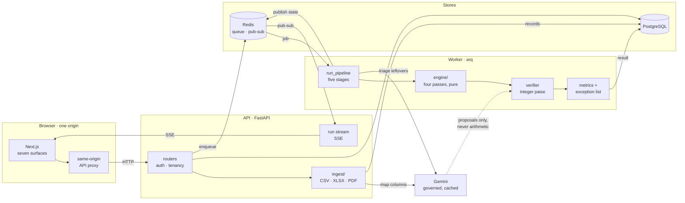

# Ledgerline

**Reconciliation that shows its work.** Every rupee walked from invoice to
payment to settlement to the line on a bank statement, with every match backed
by evidence and everything that will not tie out reported as a typed exception.

Built for the **Razorpay AI Buildathon, Track 04: AI Finance Controller**. The
brief asks for an agent that closes one finance-ops loop over a 50+ record
batch, reporting its match rate and the exceptions it could not resolve, judged
on throughput, measured accuracy and an honest exception list rather than one
cherry-picked match.

---

## The result

**300 runs. 267,602 records. Zero false matches.**

Measured on 30 held-out seeds the engine was never developed against
(5001-5030, asserted disjoint from the golden seeds in `scripts/eval.py`), at
three corpus sizes, then repeated once per corruption the adversarial mutation
engine can apply. Reproduce the whole table with
`cd backend && uv run python -m scripts.benchmark`.

| Corpus                             | Runs | Records | Precision | Recall | False matches | Auto | Exceptions | Throughput |
|------------------------------------|-----:|--------:|----------:|-------:|--------------:|-----:|-----------:|-----------:|
| clean · 150 records                |   30 |   9,560 |     1.000 |  0.892 |             0 | 0.884 |       37.7 | 592,412/s |
| clean · 600 records                |   30 |  38,248 |     1.000 |  0.973 |             0 | 0.970 |       38.5 | 561,391/s |
| clean · 2400 records               |   30 | 152,814 |     1.000 |  0.993 |             0 | 0.992 |       43.4 | 374,468/s |
| corrupted · duplicate_payment      |   30 |   9,590 |     1.000 |  0.892 |             0 | 0.878 |       38.7 | 583,589/s |
| corrupted · shift_date:45          |   30 |   9,560 |     1.000 |  0.788 |             0 | 0.777 |       71.7 | 477,439/s |
| corrupted · alter_amount:-150000   |   30 |   9,560 |     1.000 |  0.791 |             0 | 0.764 |       75.3 | 446,548/s |
| corrupted · delete_bank_line       |   30 |   9,530 |     1.000 |  0.788 |             0 | 0.777 |       70.7 | 458,315/s |
| corrupted · inject_unrelated_credit |   30 |   9,590 |     1.000 |  0.892 |             0 | 0.884 |       38.7 | 574,095/s |
| corrupted · scramble_narration     |   30 |   9,560 |     1.000 |  0.784 |             0 | 0.769 |       74.1 | 456,961/s |
| corrupted · split_payment          |   30 |   9,590 |     1.000 |  0.791 |             0 | 0.759 |       76.3 | 432,848/s |

Read the two halves together, because the second one is the point.

**Precision is 1.000 in every row.** Nothing was ever tied out that the truth
file says does not belong together. That is the verifier doing its job: every
proposed match, whoever proposed it, is recomputed in integer paise before it
is written, and a proposal that fails becomes an exception rather than a match.

**Recall falls under sabotage, and that is the honest outcome.** Corrupting a
date, an amount or a narration genuinely destroys the evidence a match needs.
The engine answers by filing exceptions -- about 38 on a clean 150-record
corpus, about 75 once records have been corrupted -- rather than by guessing.
An engine whose recall held steady under sabotage would be inventing matches,
and its precision would say so.

**Recall improves with corpus size** (0.892 at 150 records, 0.993 at 2,400): a
larger batch carries more of the counterpart records a chain needs to close, so
the unmatchable tail is a smaller share of it.

The throughput column times `engine.match()` alone -- no ingestion, no LLM
triage, no database -- because a throughput figure that quietly includes or
excludes the slow parts is advertising rather than measurement. End-to-end wall
clock for a real run, persistence and assisted triage included, is reported per
run on the Scoreboard.

### On real files, not just generated ones

A four-file upload of genuine exports -- 55 invoices, 56 payments, 53
settlements, 60 bank lines -- reconciles to **50 matched groups against 53
settlements, and 26 typed exceptions**: ten unidentified credits, eight
settlements with no bank line, five payments with no invoice, two unexplained
amount mismatches and one duplicate candidate. That list is the deliverable.
A reconciliation that reports no exceptions on real books is not finished, it
is lying.

---

## What it does

One finance-ops loop, closed end to end:

```
INVOICE (ledger) -> PAYMENT (gateway) -> SETTLEMENT BATCH (net payout, UTR) -> BANK CREDIT (statement line)
```

Four deterministic passes do the matching: bank credit to settlement on UTR and
exact amount; a payout recomputed from its own batch of payments in integer
paise; invoice to payment on an exact reference; and a bounded subset-sum for
the case where one credit covers many invoices. Whatever will not close arrives
as a typed exception carrying the check it failed and the evidence behind it.
Unsettled payments are projected forward into a fourteen-day cash position, and
a Q&A agent answers questions against the same verified data.

Two data modes:

- **Demo** -- a seeded synthetic corpus shipped with a ground-truth answer key,
  so precision and recall are measured rather than asserted. Seven typed
  corruptions can be switched on from the console, each applied to a copy of
  the corpus with the truth corrupted in lockstep, so the numbers stay
  measurable after the sabotage. A run's URL reproduces exactly what was tested.
- **Your data** -- upload CSV, XLSX or PDF. Column names are resolved against a
  table of known headers first and a model is asked only about the ones left
  over, then the same engine runs.

### The rule the whole system is built around

**The model never does arithmetic and never writes a match.** It proposes
`{links, evidence_spans, confidence}`; a deterministic verifier recomputes the
tie-out in integer paise and decides. A failed proposal surfaces as
`LLM_PROPOSAL_FAILED_VERIFY`, never as a silent match. If the model is rate
limited or returns something malformed, the run still finishes: it reports an
assist rate of zero, flags itself degraded, and files every affected item as an
exception.

The same discipline now governs schema mapping. Known column names are resolved
deterministically, the model is asked only about genuinely ambiguous headers,
and any answer of its that collides with an already-resolved field is dropped
rather than merged. Propose freely; a deterministic check decides.

---

## Architecture



- **`backend/engine` is pure Python** -- no I/O, no clock, no randomness, no
  database. A deterministic function from corpus to result, which is what makes
  a run reproducible from its seed and hash.
- **Runs execute in a separate arq worker**, never in the request handler, so
  reconciliation cannot block the API event loop.
- **The frontend is presentation only.** No matching, no money math, no metric
  computed client-side; everything rendered arrives already computed. An ESLint
  rule enforces it.
- **Cross-origin cookies are avoided entirely**: the Next.js app proxies the API
  through its own origin, so the browser only ever talks to one domain.

### Stack

| Layer | Choice |
|---|---|
| API | FastAPI, Pydantic v2, uvicorn |
| Jobs | arq + Redis, in a separate worker process |
| DB | PostgreSQL, SQLAlchemy 2.0 async, Alembic |
| Engine | Pure Python, frozen dataclasses |
| Parsing | polars (CSV/XLSX), pdfplumber (PDF) |
| LLM | `google-genai` (Gemini), server side only |
| Auth | argon2-cffi (argon2id), server-side sessions in Postgres |
| Frontend | Next.js App Router, TypeScript strict |
| API client | `openapi-typescript`, generated from the live OpenAPI schema |

---

## What broke, and how it got out

Three failures worth recording, because all three were invisible until real
files went through.

**A real gateway export validated 0 of 56 rows.** The file was fine and the
mapping was right: `payment_date` carried `2026-08-04 00:00`, and the date
parser knew exactly three shapes, each anchored end to end, so a trailing time
of day failed every one. The other three files loaded because their date
columns carry no time -- the gateway file was the only one precise about when a
capture happened, and the precision is what killed it. The parser now drops a
trailing wall-clock time before matching, and reads a real ISO instant through
`fromisoformat`, converting an offset to IST before taking the date so a
21:00 UTC capture lands on the following day, which is the day its settlement
window belongs to.

**Then it reported nothing.** The API returned a reason for all 56 rejected
rows and the console dropped them, showing "0/56 rows valid" and "nothing has
been parsed" about 56 rows it had just parsed. The engine had an honest
exception list; ingestion did not. Rejections now render grouped by cause with
row numbers, and an upload that stores nothing keeps its panel open on the
reason instead of closing onto an empty table.

**Then the corpus reconciled nothing at all** -- 224 records, 0 matches. Two
causes. The narration extractor strips the `UTR` label and yields `598806645`
while a settlement export writes `UTR598806645` in its own column, and the two
were compared as raw strings; a generated corpus never noticed, because the
generator emits the bare token and puts the label in the narration template.
And schema mapping had been left entirely to the model, which got three of four
files wrong: a ledger's `invoice_id` onto `number`, a settlement's
`gross_amount` onto `payout` when the bank credits the net, and a bank
statement's `amount` column left unmapped, zeroing every credit in the file.
Both are fixed above; the same files now tie out 50 groups.

Every one of these was a no-op on the generated corpus -- the benchmark numbers
are unchanged to four decimal places -- which is exactly why a synthetic answer
key is not sufficient evidence on its own.

---

## Running it

```
make install     # backend (uv sync) + frontend (pnpm install)
make dev         # infra + backend + worker + frontend, Ctrl+C stops all
```

Step by step; `make help` lists every target:

```
make infra-up    # redis + postgres via docker compose
make migrate     # alembic upgrade head
make backend     # FastAPI with autoreload  (localhost:8000)
make worker      # arq background worker
make gen-api     # regenerate frontend/lib/api/schema.d.ts from the live backend
make frontend    # Next.js dev server        (localhost:3000)
```

Without `DATABASE_URL`/`REDIS_URL`, the backend still starts and serves
`/health`; any route needing Postgres or Redis returns `503`.

### Repo layout

```
backend/    FastAPI app, engine, ingestion, LLM gateway, workers, tests
frontend/   Next.js app: Run, Scoreboard, Chain, Exceptions, Data, Cash position, Method
docker/     docker-compose for local Postgres + Redis
fixtures/   golden metrics, pinned per seed
Makefile    install / run / test
```

See [`backend/README.md`](backend/README.md) and
[`frontend/README.md`](frontend/README.md) for environment variables and the
validation commands (`ruff`, `mypy`, `pytest`, `lint-imports`).

---

## Status, honestly

Runs work end to end against both a generated corpus and an uploaded dataset.
373 backend tests pass; `ruff`, `mypy` and three import-linter contracts are
clean.

Outstanding: no CI, no frontend test suite (Playwright/vitest/axe), no
Dockerfiles or full-topology compose, and `/health` is a liveness stub that
checks no dependency.
