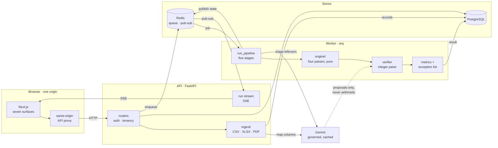

# Ledgerline

Multi-source financial reconciliation with a verifier-gated LLM assist, an honest exception list, and bring-your-own-data.

Built for the Razorpay AI Buildathon, **Track 04: AI Finance Controller** ("run the books and the cash position"). The brief asks for an agent that closes one finance-ops loop across a 50+ record batch of synthetic data, reporting its match rate and the exceptions it could not resolve, judged on throughput, measured accuracy, and an honest exception list rather than a cherry-picked match. Ledgerline's answer combines the track's two suggested directions (multi-source reconciliation and a forward cash forecaster) with a settlement Q&A agent (`backend/llm/ask.py`, `frontend/components/AskPanel.tsx`) on top of the same verified data.

## What it does

Ledgerline closes one finance-ops loop end to end:

```
INVOICE (ledger) -> PAYMENT (gateway) -> SETTLEMENT BATCH (net payout, UTR) -> BANK CREDIT (statement line)
```

It ingests a batch of 50–5,000 records across those sources, reconciles them, reports match rate and measured accuracy, emits a typed exception list for everything it can't close, and projects the forward cash position from unsettled payments.

Two data modes:
- **Demo mode**: seeded synthetic corpus shipped with a ground-truth answer key, so precision/recall are measured, not guessed.
- **My data mode**: upload CSV, XLSX or PDF; columns are auto-mapped to the canonical schema (LLM-assisted, user-confirmed), and the same engine runs.

Key engineering property: **the LLM never does arithmetic and never writes a match**. It proposes `{links, evidence_spans, confidence}`; a deterministic verifier recomputes the tie-out in integer paise. Failed proposals surface as exceptions (`LLM_PROPOSAL_FAILED_VERIFY`), never as silent matches.

## Architecture



- **`backend/engine`** is pure Python (no I/O, no clock, no randomness, no DB), a deterministic function from corpus to result.
- **Runs execute in a separate arq worker process**, not the request handler, so reconciliation never blocks the API event loop.
- **The frontend is presentation only.** No matching, no money math, no metric computation happens client-side; everything rendered comes from the API already computed. An ESLint rule enforces this (see `frontend/README.md`).
- Cross-origin cookies are avoided entirely: the Next.js app proxies API requests through its own origin (`frontend/app/api/[...path]/route.ts`), so the browser only ever talks to one domain.

### Stack

| Layer | Choice |
|---|---|
| API | FastAPI, Pydantic v2, uvicorn |
| Jobs | arq + Redis (separate worker) |
| DB | PostgreSQL, SQLAlchemy 2.0 async, Alembic |
| Engine | Pure Python, frozen dataclasses |
| Parsing | polars (CSV/XLSX), pdfplumber (PDF) |
| LLM | `google-genai` (Gemini), server side only |
| Auth | argon2-cffi (argon2id), server-side sessions in Postgres |
| Frontend | Next.js App Router, TypeScript strict |
| API client | `openapi-typescript`, generated from the live OpenAPI schema |

## Repo layout

```
backend/    FastAPI app, engine, ingestion, LLM gateway, workers, tests   (see backend/README.md)
frontend/   Next.js app: the seven surfaces (Run, Scoreboard, Chain,
            Exceptions, Data, Cash position, Method)                     (see frontend/README.md)
docker/     docker-compose for local Postgres + Redis
fixtures/   sample data
Makefile    convenience targets for install / run / test
```

## Running locally

```
make install     # backend (uv sync) + frontend (pnpm install)
make dev         # infra (postgres+redis) + backend + worker + frontend, Ctrl+C stops all
```

Or step by step; `make help` lists every target:

```
make infra-up    # redis + postgres via docker compose
make migrate     # alembic upgrade head
make backend     # FastAPI with autoreload  (localhost:8000)
make worker      # arq background worker
make gen-api     # regenerate frontend/lib/api/schema.d.ts from the live backend
make frontend    # Next.js dev server        (localhost:3000)
```

Without `DATABASE_URL`/`REDIS_URL` configured, the backend still starts and serves `/health`; any route needing the database or Redis returns `503`. See [`backend/README.md`](backend/README.md) and [`frontend/README.md`](frontend/README.md) for details, environment variables, and validation commands (`ruff`, `mypy`, `pytest`, `lint-imports`).

## Measured results

The track's bar is throughput, measured accuracy and an honest exception list, so here are all three, on corpora the engine was never developed against. `backend/scripts/benchmark.py` sweeps 30 held-out seeds (5001-5030, disjoint from the three golden seeds pinned in `scripts/eval.py`) at three sizes, then repeats the sweep once per corruption the mutation engine can apply. Reproduce with `cd backend && uv run python -m scripts.benchmark`.

| Corpus                             | Runs | Records | Precision | Recall | False matches | Auto | Exceptions | Throughput |
|------------------------------------|-----:|--------:|----------:|-------:|--------------:|-----:|-----------:|-----------:|
| clean · 150 records                |   30 |   9,560 |     1.000 |  0.892 |             0 | 0.884 |       37.7 | 571,365/s |
| clean · 600 records                |   30 |  38,248 |     1.000 |  0.973 |             0 | 0.970 |       38.5 | 582,348/s |
| clean · 2400 records               |   30 | 152,814 |     1.000 |  0.993 |             0 | 0.992 |       43.4 | 384,545/s |
| corrupted · duplicate_payment      |   30 |   9,590 |     1.000 |  0.892 |             0 | 0.878 |       38.7 | 582,551/s |
| corrupted · shift_date:45          |   30 |   9,560 |     1.000 |  0.788 |             0 | 0.777 |       71.7 | 465,692/s |
| corrupted · alter_amount:-150000   |   30 |   9,560 |     1.000 |  0.791 |             0 | 0.764 |       75.3 | 479,130/s |
| corrupted · delete_bank_line       |   30 |   9,530 |     1.000 |  0.788 |             0 | 0.777 |       70.7 | 484,144/s |
| corrupted · inject_unrelated_credit |   30 |   9,590 |     1.000 |  0.892 |             0 | 0.884 |       38.7 | 576,191/s |
| corrupted · scramble_narration     |   30 |   9,560 |     1.000 |  0.784 |             0 | 0.769 |       74.1 | 479,412/s |
| corrupted · split_payment          |   30 |   9,590 |     1.000 |  0.791 |             0 | 0.759 |       76.3 | 463,755/s |

300 runs · 267,602 records · 0 false matches across every run.
Throughput times engine.match() alone: no ingestion, no LLM triage, no database.

Read the two halves together, because the second one is the point:

- **Precision is 1.000 in every row, and 300 runs over 267,602 records produced zero false matches.** Nothing was ever tied out that the truth file says does not belong together. That is the verifier doing its job: a proposal that fails its recompute in integer paise becomes an exception, never a match.
- **Recall falls under sabotage, and that is the honest outcome.** Corrupting a date, an amount or a narration genuinely destroys the evidence a match needs. The engine answers by filing exceptions -- about 38 on a clean 150-record corpus, about 75 once records have been corrupted -- rather than by guessing. An engine whose recall held steady under sabotage would be inventing matches, and its precision would say so.
- **Recall improves with corpus size** (0.892 at 150 records, 0.993 at 2400): a larger batch carries more of the counterpart records a chain needs to close, so the unmatchable tail is a smaller share of it.

The throughput column times `engine.match()` alone -- no ingestion, no LLM triage, no database -- because a throughput number that quietly includes or excludes the slow parts is advertising rather than measurement. End-to-end wall clock for a real run, persistence and assisted triage included, is reported per run on the Scoreboard.

## Status

Runs work end to end against both a generated corpus and an uploaded dataset. The adversarial mutation engine is in (`backend/datagen/mutations.py`): seven typed corruptions, each applied to a copy of the corpus with the ground truth corrupted in lockstep, so precision, recall and false matches stay measurable after the sabotage. They are opt-in from the Run console and recorded on the run, so a run's URL reproduces exactly what was tested.

Still outstanding against the plan: no CI, no frontend test suite (Playwright/vitest/axe), no Dockerfiles or full-topology compose, and `/health` is a stub. See the "Known, documented gaps" section in [`frontend/README.md`](frontend/README.md).
